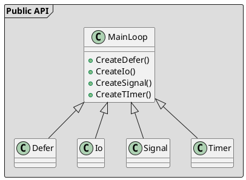

# Using sdevent-cpp library

<!-- TOC -->autoauto- [Using sdevent c++ library](#using-sdevent-c-library)auto    - [Introduction](#introduction)auto    - [Integrating sdevent-cpp into your project](#integrating-sdevent-c-into-your-project)auto        - [Yocto](#yocto)autoauto<!-- /TOC -->

## Introduction

sdevent-cpp is a C++ main loop library built on top of [sd-event](http://0pointer.net/blog/introducing-sd-event.html), a library wrappeing Linux epoll implemented within [systemd](https://github.com/systemd/systemd) project. It provides event loop functionality on a higher level of abstraction, trying to employ C++ type system to shift as much work as possible from the developer to the compiler.

Although sdevent-cpp covers most of sd-event API, it does not (yet) fully cover every sd-event API detail. The focus is put on the most widely used functionality.

## Integrating into your project

The library build system is based on CMake. The library provides a config and an export file, so integrating it into your CMake project is simple:

```cmake
# First, find sdevent-cpp
find_package(sdevent-cpp REQUIRED)

# Use the sdevent-cpp target in SDEventCpp namespace
add_executable(exe exe.cpp)
target_link_libraries(exe PRIVATE SDEventCpp::sdevent-cpp)
```

The library also supports `pkg-config`, so it easily be integrated into e.g. an Autotools project:

```bash
PKG_CHECK_MODULES(SDBUSCPP, [sdevent-cpp >= 0.1.0],,
    AC_MSG_ERROR([You need the sdevent-cpp library (version 0.1 or newer)]
    [https://github.com/afreof/sdevent-cpp])
)
```

Note: sdevent-cpp library uses a number of modern C++17 features. Please make certain you have a recent compiler (gcc >= 7, clang >= 6).

## Distributing sdevent-cpp

### Yocto

There are Yocto recipes for sdevent-cpp available in the [`meta-oe`](https://github.com/openembedded/meta-openembedded/tree/master/meta-oe/recipes-core/sdevent-cpp) layer of the `meta-openembedded` project.

Contributors willing to help with bringing sdevent-cpp to other popular package systems are welcome.

## Header files and namespaces

All sdevent-cpp header files reside in the `sdevent-cpp` subdirectory within the standard include directory. Users can just include the global header file that pulls in everything:

```cpp
#include <sdevent-cpp/sdevent-cpp.h>
```

All public types and functions of sdevent-cpp reside in the `sdevent` namespace.

## Error signalling and propagation

`sdevent::Error` exception is used to signal errors in sdevent-cpp.

## Design of sdevent-cpp

The following diagram illustrates the major entities in sdevent-cpp.



`MainLoop` Wrapper around a sd-event loop object as described at <https://www.freedesktop.org/software/systemd/man/sd-event.html>.

`Defer` Wrapper around a sd-event loop object as described at <https://www.freedesktop.org/software/systemd/man/sd_event_add_defer.html>.

`Io` Wrapper around a sd-event loop object as described at <https://www.freedesktop.org/software/systemd/man/sd_event_add_io.html>.

`Signal` Wrapper around a sd-event loop object as described at <https://www.freedesktop.org/software/systemd/man/sd_event_add_signal.html>.

`Timer` Wrapper around a sd-event loop object as described at <https://www.freedesktop.org/software/systemd/man/sd_event_add_timer.html>.
